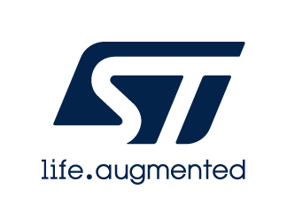

# Release Notes for <mark>STM32C0xx_Nucleo BSP Drivers</mark>
Copyright &copy; 2022 STMicroelectronics\
    

# Purpose

The BSP (Board Specific Package) drivers are parts of the STM32Cube package based on the HAL drivers and provide a set of high level APIs relative to the hardware components and features in the evaluation boards, discovery kits and nucleo boards coming with the STM32Cube package for a given STM32 series.

The BSP drivers allow a quick access to the boards’ services using high level APIs and without any specific configuration as the link with the HAL and the external components is done in intrinsic within the drivers. 

From project settings points of view, user has only to add the necessary driver’s files in the workspace and call the needed functions from examples. However some low level configuration functions are weak and can be overridden by the applications if user wants to change some BSP drivers default behavior.

*Note that stm32c0xx_nucleo_conf_template.h file must be copied in user application as
stm32c0xx_nucleo_conf.h with optional configuration update.*

# Update History

<label for="collapse-section3" aria-hidden="true">__V1.1.1 / 26-June-2026__</label>

## Main Changes

- Update BSP_BUTTON_USER_IT_PRIORITY value from 15U to 3U.

<label for="collapse-section2" aria-hidden="true">__V1.1.0 / 05-June-2024__</label>

## Main Changes

- Add support of **NUCLEO-64** board for STM32C071xx devices.
- Update printf() implementation to be compliant with IAR EWARM V9.20.1.

<label for="collapse-section1" aria-hidden="true">__V1.0.0 / 09-February-2022__</label>

## Main Changes

First official release of __STM32C0xx_Nucleo__ BSP drivers in line with STM32Cube BSP drivers development guidelines (UM2298)

For complete documentation on <mark>STM32 Microcontrollers</mark> ,
visit: [[www.st.com](http://www.st.com/STM32